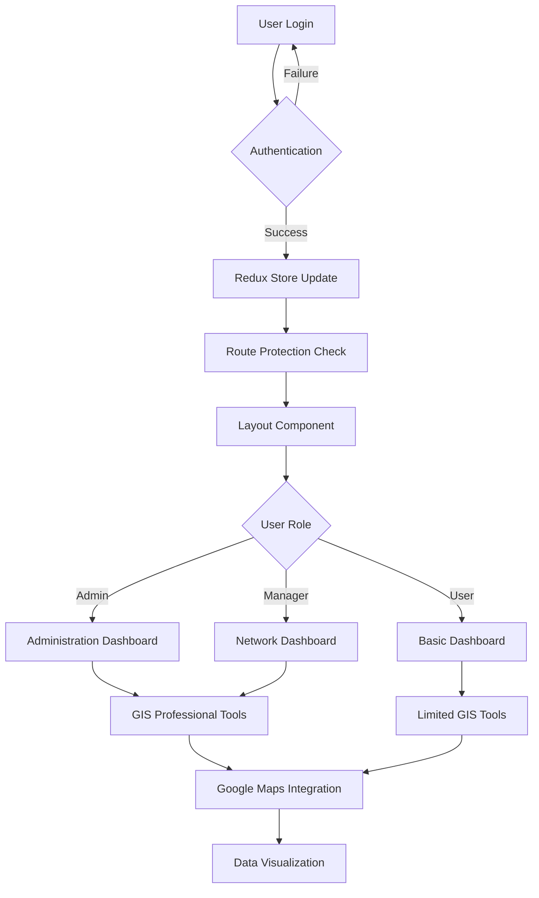

# Geographic Information System (GIS) Application - Complete Documentation

## Table of Contents
1. [Project Overview](#project-overview)
2. [Architecture & Flow](#architecture--flow)
3. [Technology Stack](#technology-stack)
4. [Project Structure](#project-structure)
5. [Redux State Management](#redux-state-management)
6. [Authentication System](#authentication-system)
7. [Component Architecture](#component-architecture)
8. [API Service Layer](#api-service-layer)
9. [GIS Features](#gis-features)
10. [Setup & Installation](#setup--installation)
11. [Development Workflow](#development-workflow)
12. [Deployment Guide](#deployment-guide)

## Project Overview

This is a comprehensive Geographic Information System (GIS) application built with React, Redux Toolkit, and Google Maps API. The application provides role-based access control, interactive mapping capabilities, distance measurement tools, and administrative features for managing users and regions.

### Key Features
- **Role-based Authentication** (Admin, Manager, Normal User)
- **Interactive GIS Dashboard** with Google Maps integration
- **Distance & Area Measurement Tools**
- **Region-based Access Control**
- **User Management System**
- **Infrastructure Data Visualization**
- **Responsive Design** with Material-UI and Chakra UI

## Architecture & Flow



### Application Flow
1. **Authentication Layer**: Users login through secure authentication
2. **Route Protection**: Protected routes check authentication status
3. **Role-based Access**: Different dashboards based on user roles
4. **GIS Integration**: Google Maps with measurement and visualization tools
5. **Data Management**: CRUD operations for users, regions, and GIS data

## Technology Stack

### Core Dependencies
```json
{
  "react": "^18.3.1",
  "react-dom": "^18.3.1",
  "react-router-dom": "^7.9.1",
  "vite": "^7.1.2"
}
```

### State Management
```json
{
  "@reduxjs/toolkit": "^2.9.0",
  "react-redux": "^9.2.0"
}
```

### UI Libraries
```json
{
  "@chakra-ui/react": "^3.25.0",
  "@mui/material": "^7.3.2",
  "@mui/icons-material": "^7.3.2",
  "framer-motion": "^12.23.12",
  "lucide-react": "^0.542.0",
  "react-icons": "^5.5.0"
}
```

### GIS & Mapping
```json
{
  "@react-google-maps/api": "^2.20.7",
  "@googlemaps/markerclusterer": "^2.6.2"
}
```

### Data Visualization
```json
{
  "chart.js": "^4.5.0",
  "react-chartjs-2": "^5.3.0",
  "apexcharts": "^5.3.4",
  "react-apexcharts": "^1.7.0",
  "recharts": "^3.1.2"
}
```

### File Processing
```json
{
  "@tmcw/togeojson": "^7.1.2",
  "papaparse": "^5.5.3",
  "xlsx": "^0.18.5",
  "jszip": "^3.10.1",
  "file-saver": "^2.0.5"
}
```

### Development Tools
```json
{
  "eslint": "^9.35.0",
  "tailwindcss": "^4.1.12",
  "autoprefixer": "^10.4.21"
}
```

## Project Structure

```
src/
├── components/
│   ├── auth/                    # Authentication components
│   │   ├── LoginBox.jsx         # Main login component
│   │   ├── LeftImage.jsx        # Login page image
│   │   └── ProtectedRoute.jsx   # Route protection wrapper
│   ├── common/                  # Shared components
│   │   ├── AddLocationForm.jsx  # Location addition form
│   │   ├── GISToolWrapper.jsx   # GIS tools wrapper
│   │   ├── QuickMapAccess.jsx   # Quick access to map tools
│   │   ├── RegionAccessGuard.jsx # Region-based access control
│   │   └── withRegionAccess.jsx # HOC for region access
│   ├── features/                # Feature-specific components
│   │   ├── administration/      # Admin panel components
│   │   ├── dashboard/           # Dashboard components
│   │   ├── network/             # Network management
│   │   └── gis/                 # GIS-specific components
│   ├── layout/                  # Layout components
│   │   ├── Layout.jsx           # Main layout wrapper
│   │   ├── Navbar.jsx           # Navigation bar
│   │   ├── NavLinks.jsx         # Navigation links
│   │   ├── ProfileMenu.jsx      # User profile menu
│   │   └── MobileDrawer.jsx     # Mobile navigation
│   └── MeasureDistance/         # Distance measurement tools
├── redux/                       # State management
│   ├── slices/                  # Redux slices
│   │   ├── authSlice.js         # Authentication state
│   │   ├── regionSlice.js       # Region management state
│   │   └── userSlice.js         # User management state
│   └── store.js                 # Redux store configuration
├── services/                    # API services
│   └── api.js                   # Main API service
├── utils/                       # Utility functions
│   ├── auth.js                  # Authentication utilities
│   ├── permissions.js           # Permission checking
│   ├── regionUtils.js           # Region-related utilities
│   ├── mapUtils.js              # Map utilities
│   └── measurementUtils.js      # Measurement calculations
├── hooks/                       # Custom React hooks
│   ├── useGoogleMapsWithMeasurement.js
│   └── useIndiaBoundary.js
├── assets/                      # Static assets
├── App.jsx                      # Main application component
├── main.jsx                     # Application entry point
└── config.js                    # Configuration settings
```

## Redux State Management

### Store Configuration
```javascript
// redux/store.js
import { configureStore } from "@reduxjs/toolkit";
import authReducer from "./slices/authSlice";
import regionReducer from "./slices/regionSlice";
import userReducer from "./slices/userSlice";

export const store = configureStore({
  reducer: {
    auth: authReducer,
    region: regionReducer,
    user: userReducer,
  },
  middleware: (getDefaultMiddleware) =>
    getDefaultMiddleware({
      serializableCheck: {
        ignoredActions: ['persist/PERSIST'],
      },
    }),
});
```

### Auth Slice Structure
```javascript
// State Shape
{
  auth: {
    user: {
      id: string,
      username: string,
      role: string,
      isAdmin: boolean,
      regions: Array,
      permissions: Object
    },
    token: string,
    loginTime: string,
    isAuthenticated: boolean,
    loading: boolean,
    error: string,
    message: string
  }
}
```

### Async Thunks
- **login**: Handles user authentication
- **logout**: Manages user logout
- **restoreSession**: Restores user session from localStorage

### Selectors
```javascript
export const selectAuth = (state) => state.auth;
export const selectUser = (state) => state.auth.user;
export const selectIsAuthenticated = (state) => state.auth.isAuthenticated;
export const selectUserRole = (state) => state.auth.user?.role;
export const selectIsAdmin = (state) => state.auth.user?.isAdmin || false;
export const selectUserRegions = (state) => state.auth.user?.regions || [];
export const selectUserPermissions = (state) => state.auth.user?.permissions || {};
```

## Authentication System

### Login Flow
1. **User Input**: Username and password entered in LoginBox component
2. **Redux Action**: `login` thunk dispatched with credentials
3. **API Call**: ApiService handles authentication (localStorage in dev mode)
4. **State Update**: Auth slice updated with user data and token
5. **Route Redirect**: User redirected to appropriate dashboard
6. **Session Storage**: User data stored in localStorage for persistence

### Role-Based Access Control
```javascript
// User Roles
const ROLES = {
  ADMIN: "Admin",
  MANAGER: "Manager", 
  USER: "Normal User"
};

// Permission Structure
const permissions = {
  distance: boolean,      // Distance measurement tools
  polygon: boolean,       // Polygon drawing tools
  elevation: boolean,     // Elevation data access
  infrastructure: boolean, // Infrastructure data
  userManagement: boolean // User management access
};
```

### Protected Routes
```javascript
// ProtectedRoute component checks:
// 1. Authentication status
// 2. Admin requirements (if specified)
// 3. Region access permissions
// 4. Feature permissions

<ProtectedRoute requireAdmin={true}>
  <Administration />
</ProtectedRoute>
```

### Region-Based Access
Users are assigned specific geographic regions they can access:
```javascript
const userRegions = [
  {
    id: 'maharashtra',
    name: 'Maharashtra',
    bounds: [[15.6, 72.6], [22.0, 80.9]]
  }
];
```

## Component Architecture

### Layout System
```
Layout.jsx
├── Navbar.jsx
│   ├── Logo.jsx
│   ├── NavLinks.jsx
│   └── ProfileMenu.jsx
├── MobileDrawer.jsx
└── {children} (Page Content)
```

### Feature Components
Each feature follows a modular structure:
```
features/administration/
├── AdministrationMain.jsx      # Main container
├── SummaryCards.jsx           # Statistics cards
├── TopBar/                    # Search and filters
├── UserDisplay/               # User list/table
└── DialogContainer/           # User management dialogs
```

### GIS Components
```
gis/
├── GISProfessionalDashboard.jsx  # Main GIS interface
├── dashboard/
│   ├── GISDashboard.jsx          # GIS dashboard container
│   └── components/
│       ├── GISMapContainer.jsx   # Map wrapper
│       ├── GISNavbar.jsx         # GIS navigation
│       ├── GISSidebar.jsx        # Tools sidebar
│       └── GISToolsPanel.jsx     # Tool controls
└── map/
    ├── MapErrorBoundary.jsx      # Error handling
    └── MapSearchBox.jsx          # Map search functionality
```

## API Service Layer

### Development vs Production Mode
The API service supports both development (localStorage) and production (backend API) modes:

```javascript
const isDevelopment = import.meta.env.VITE_USE_MOCK === "true";

class ApiService {
  async makeRequest(endpoint, options = {}) {
    if (this.isDevelopment) {
      return this.handleLocalStorageRequest(endpoint, options);
    }
    // Production API calls
    return fetch(`${this.baseURL}${endpoint}`, config);
  }
}
```

### API Endpoints
- **Authentication**: `/auth/login`, `/auth/logout`, `/auth/session`
- **User Management**: `/users`, `/users/create`, `/users/:id`
- **Region Management**: `/regions`, `/regions/assign`
- **GIS Features**: `/gis/distance`, `/gis/polygon`, `/gis/elevation`

### Mock Data Structure
Development mode uses localStorage with predefined users:
```javascript
const fallbackUsers = [
  {
    id: 'admin-001',
    username: "admin",
    password: "admin123",
    role: "Admin",
    regions: [{ id: 'bharat', name: 'Bharat' }],
    permissions: { /* all permissions */ }
  }
];
```

## GIS Features

### Google Maps Integration
- **Map Container**: React wrapper for Google Maps
- **Marker Clustering**: Efficient marker management
- **Drawing Tools**: Distance and area measurement
- **Elevation Service**: Terrain elevation data
- **Geocoding**: Address to coordinates conversion

### Measurement Tools
```javascript
// Distance Measurement
const measureDistance = (path) => {
  let totalDistance = 0;
  for (let i = 0; i < path.length - 1; i++) {
    totalDistance += google.maps.geometry.spherical.computeDistanceBetween(
      path[i], path[i + 1]
    );
  }
  return totalDistance;
};
```

### Data Visualization
- **Charts**: Chart.js, ApexCharts, Recharts integration
- **Infrastructure Data**: CSV/Excel file processing
- **GeoJSON Support**: Geographic data visualization
- **Export Functionality**: Data export in multiple formats

## Setup & Installation

### Prerequisites
- Node.js (v16 or higher)
- npm or yarn package manager
- Google Maps API key

### Installation Steps
```bash
# Clone the repository
git clone <repository-url>
cd app

# Install dependencies
npm install

# Create environment file
cp .env.example .env

# Add your Google Maps API key
VITE_GOOGLE_MAPS_API_KEY=your_api_key_here
VITE_USE_MOCK=true
VITE_API_BASE_URL=http://localhost:3001/api

# Start development server
npm run dev
```

### Environment Variables
```env
VITE_GOOGLE_MAPS_API_KEY=your_google_maps_api_key
VITE_USE_MOCK=true
VITE_API_BASE_URL=http://localhost:3001/api
```

## Development Workflow

### Default Login Credentials
```
Admin:
- Username: admin
- Password: admin123

Manager:
- Username: manager1  
- Password: manager123

User:
- Username: user1
- Password: user123
```

### Development Commands
```bash
npm run dev      # Start development server
npm run build    # Build for production
npm run preview  # Preview production build
npm run lint     # Run ESLint
```

### Code Structure Guidelines
1. **Components**: Use functional components with hooks
2. **State Management**: Use Redux Toolkit for global state
3. **Styling**: Combine Tailwind CSS with Material-UI/Chakra UI
4. **File Organization**: Group by feature, not by file type
5. **Error Handling**: Implement error boundaries and try-catch blocks

## Deployment Guide

### Production Build
```bash
# Build the application
npm run build

# The build files will be in the 'dist' directory
```

### Environment Setup
1. **Backend API**: Set up production API endpoints
2. **Database**: Configure user and region data storage
3. **Google Maps**: Ensure API key has proper restrictions
4. **HTTPS**: Enable HTTPS for production deployment

### Deployment Options
- **Vercel**: `vercel --prod`
- **Netlify**: Connect GitHub repository
- **AWS S3**: Upload build files to S3 bucket
- **Docker**: Use provided Dockerfile

### Production Considerations
1. **API Security**: Implement proper authentication tokens
2. **Data Persistence**: Replace localStorage with database
3. **Error Monitoring**: Add error tracking (Sentry, etc.)
4. **Performance**: Implement code splitting and lazy loading
5. **SEO**: Add meta tags and structured data

## Key Features Summary

### Authentication & Authorization
- ✅ Role-based access control (Admin, Manager, User)
- ✅ Region-based permissions
- ✅ Protected routes
- ✅ Session management
- ✅ Secure logout

### GIS Capabilities
- ✅ Interactive Google Maps
- ✅ Distance measurement tools
- ✅ Polygon drawing and area calculation
- ✅ Elevation data integration
- ✅ Infrastructure data visualization
- ✅ GeoJSON file support

### User Management
- ✅ User creation and management
- ✅ Role assignment
- ✅ Region access control
- ✅ User activity tracking
- ✅ Bulk operations

### Data Management
- ✅ CSV/Excel file import
- ✅ Data export functionality
- ✅ Real-time data updates
- ✅ Data validation
- ✅ Backup and restore

### UI/UX
- ✅ Responsive design
- ✅ Modern UI components
- ✅ Dark/light theme support
- ✅ Mobile-friendly interface
- ✅ Accessibility features

This documentation provides a comprehensive overview of the GIS application architecture, implementation details, and deployment guidelines. The application is designed to be scalable, maintainable, and user-friendly while providing powerful GIS capabilities for different user roles.