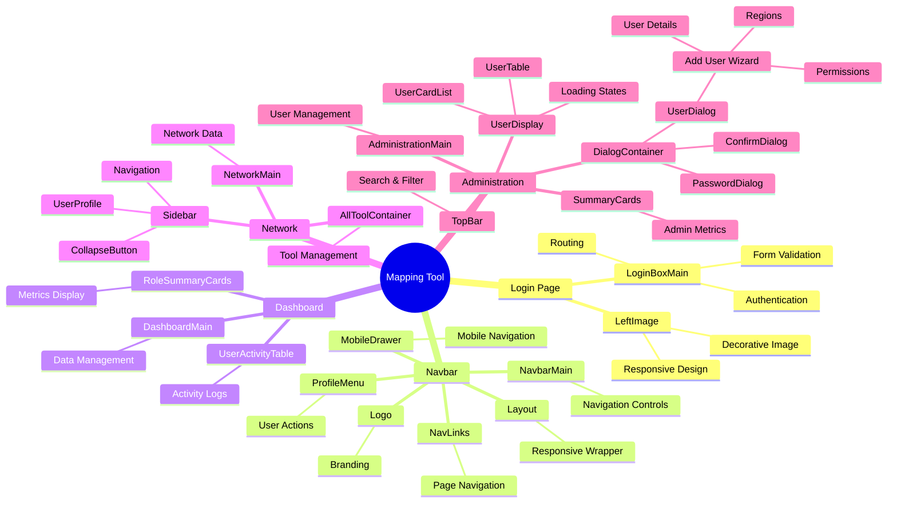

# Component Hierarchy Documentation

## Visual Hierarchy

### 1. Top-Level Component Structure

```mermaid
graph TD
    A[App] --> B[1. LoginPage]
    A --> C[2. NavbarPage]
    A --> D[3. DashboardPage]
    A --> E[4. NetworkPage]
    A --> F[5. AdministrationPage]
    
    %% Login Page Components
    B --> B1[1.1 LoginBoxMain]
    B --> B2[1.2 LeftImage]
    
    %% Navbar Components
    C --> C1[2.0 Layout]
    C --> C2[2.1 NavbarMain]
    C --> C3[2.2 Logo]
    C --> C4[2.3 NavLinks]
    C --> C5[2.4 ProfileMenu]
    C --> C6[2.5 MobileDrawer]
    
    %% Dashboard Components
    D --> D1[3.0 DashboardMain]
    D --> D2[3.1 RoleSummaryCards]
    D --> D3[3.2 UserActivityTable]
    
    %% Network Page Components
    E --> E1[4.0 NetworkMain]
    E --> E2[4.1 AllToolContainer]
    E --> E3[4.2 Sidebar]
    
    %% Administration Page Components
    F --> F1[5.0 AdministrationMain]
    F --> F2[5.1 SummaryCards]
    F --> F3[5.2 TopBar]
    F --> F4[5.3 UserDisplay]
    F --> F5[5.4 DialogContainer]
    
    %% Sidebar Subcomponents
    E3 --> E3a[4.2.1 SidebarMenuItem]
    E3 --> E3b[4.2.2 UserProfile]
    E3 --> E3c[4.2.3 CollapseButton]
    
    %% TopBar Subcomponents
    F3 --> F3a[5.2.1 TopBar]
    F3 --> F3b[5.2.2 SearchFilterBar]
    
    %% UserDisplay Subcomponents
    F4 --> F4a[5.3.1 UserCardList]
    F4 --> F4b[5.3.2 UserTable]
    F4 --> F4c[CardSkeleton]
    F4 --> F4d[TableSkeleton]
    
    %% Dialog Container Subcomponents
    F5 --> F5a[5.4.1 DialogsContainer]
    F5 --> F5b[5.4.2 UserDialog]
    F5 --> F5c[5.4.3 PasswordDialog]
    F5 --> F5d[5.4.4 ConfirmDialog]
    
    %% Add User Wizard Steps
    F5b --> F5b1[5.4.2.1 AddUser]
    F5b1 --> F5b1a[5.4.2.2 Step1UserDetails]
    F5b1 --> F5b1b[5.4.2.3 Step2Permissions]
    F5b1 --> F5b1c[5.4.2.4 Step3Regions]
```

### 2. Detailed Component Mind Map

## Component Descriptions

### 1. LoginPage
- **1.1 LoginBoxMain**
  - Main login form component
  - Handles user authentication
  - Manages form state and validation
  - Routes to dashboard on successful login

- **1.2 LeftImage**
  - Displays a decorative image on the login page
  - Handles responsive image display

### 2. NavbarPage
- **2.0 Layout**
  - Main layout wrapper
  - Contains the navigation structure
  - Manages responsive layout

- **2.1 NavbarMain**
  - Main navigation bar component
  - Contains app title and navigation controls

- **2.2 Logo**
  - Displays the application logo
  - Handles logo click behavior

- **2.3 NavLinks**
  - Renders navigation links
  - Handles active link state

- **2.4 ProfileMenu**
  - User profile dropdown menu
  - Shows user information and actions

- **2.5 MobileDrawer**
  - Mobile-responsive navigation drawer
  - Contains mobile menu items

### 3. DashboardPage
- **3.0 DashboardMain**
  - Main dashboard container
  - Fetches and displays dashboard data
  - Manages dashboard state

- **3.1 RoleSummaryCards**
  - Displays summary cards for different user roles
  - Shows key metrics and statistics

- **3.2 UserActivityTable**
  - Displays recent user activities
  - Supports sorting and pagination

### 4. NetworkPage
- **4.0 NetworkMain**
  - Main container for network features
  - Manages network data and state

- **4.1 AllToolContainer**
  - Container for network tools
  - Manages tool selection and display

- **4.2 Sidebar**
  - **4.2.1 SidebarMenuItem**: Individual menu items
  - **4.2.2 UserProfile**: Displays user information
  - **4.2.3 CollapseButton**: Toggles sidebar collapse state

### 5. AdministrationPage
- **5.0 AdministrationMain**
  - Main administration container
  - Manages user data and state

- **5.1 SummaryCards**
  - Displays administrative summary statistics
  - Shows key metrics for administrators

- **5.2 TopBar**
  - **5.2.1 TopBar**: Main top bar component
  - **5.2.2 SearchFilterBar**: Handles search and filtering

- **5.3 UserDisplay**
  - **5.3.1 UserCardList**: Displays users in card format
  - **5.3.2 UserTable**: Displays users in table format
  - **CardSkeleton**: Loading skeleton for user cards
  - **TableSkeleton**: Loading skeleton for user table

- **5.4 DialogContainer**
  - **5.4.1 DialogsContainer**: Manages dialog state
  - **5.4.2 UserDialog**: User management dialog
  - **5.4.3 PasswordDialog**: Password change dialog
  - **5.4.4 ConfirmDialog**: Confirmation dialog
  
  #### Add User Wizard
  - **5.4.2.1 AddUser**: Main add user wizard
    - **5.4.2.2 Step1UserDetails**: User details form
    - **5.4.2.3 Step2Permissions**: Permission settings
    - **5.4.2.4 Step3Regions**: Region assignment

## Data Flow
1. User authentication flows through LoginPage components
2. Protected routes are wrapped with authentication checks
3. State management is handled by Redux
4. Components subscribe to relevant state slices
5. User interactions trigger actions that update the state
6. UI updates in response to state changes

## Key Features
- Protected routes for authenticated access
- Responsive layout with navbar and sidebar
- User management functionality
- Network visualization and tools
- Dashboard with key metrics
- Multi-step forms for user management
- Loading states with skeleton placeholders
- Responsive design for all screen sizes

## Dependencies
- React Router for navigation
- Redux for state management
- Material-UI for UI components
- Formik for form handling
- Yup for form validation
- Various utility libraries for data visualization and UI enhancements
